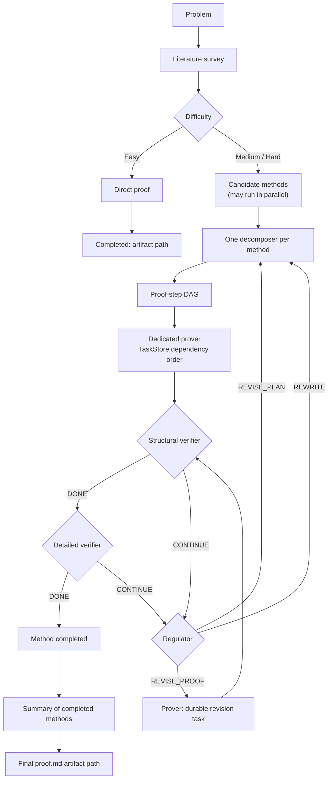
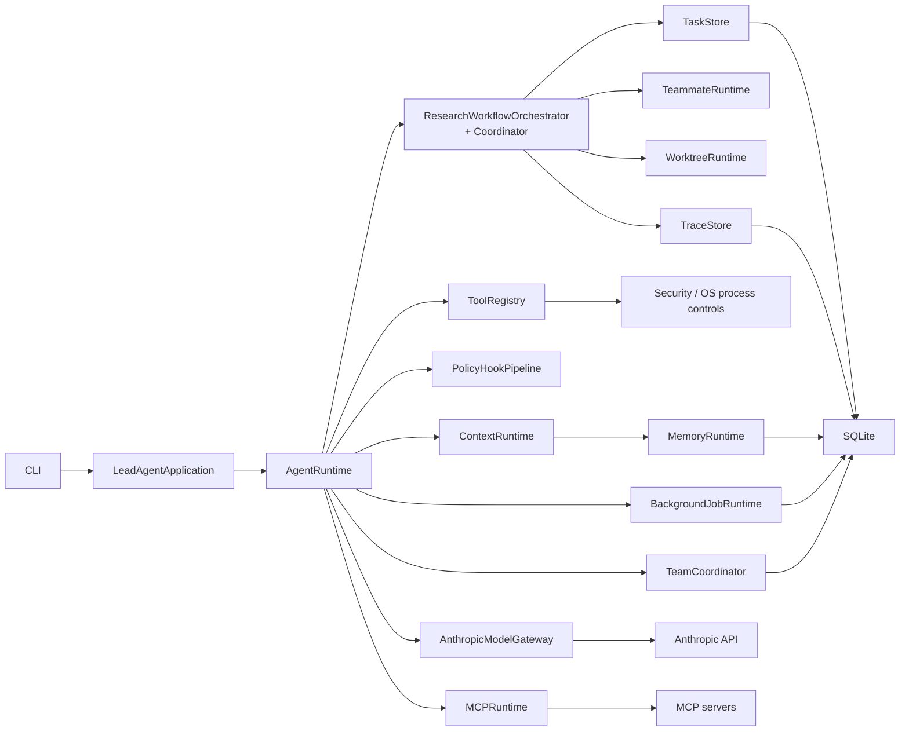

# ResearchAgent Runtime

Safe, durable multi-agent orchestration for autonomous mathematical research.

ResearchAgent Runtime is a Python orchestration project for long-running mathematical work, not a general chatbot or a single ReAct loop. It combines durable task execution, method-specific teammates, a gated proof workflow, safer tool execution, context and memory management, MCP integration, and runtime traces. The system coordinates and checks the research process; it does not guarantee that an LLM-generated proof is mathematically correct.

> The central design principle is: **reasoning is soft, control flow is hard.**

LLM agents propose mathematical content and reviewer verdicts. Python state machines decide which workflow transition is legal. Natural-language instructions alone cannot skip a verifier stage or a TaskStore dependency.

## Why This Project Exists

A mathematical proof can require literature search, competing strategies, decomposition into dependent lemmas, proof construction, two kinds of verification, revision, and final synthesis. A long model conversation can lose context or claim completion before those steps are done.

This project gives that process durable state. The Lead coordinates agents; each candidate method has its own decomposition and prover; proof steps become dependency-linked tasks; verifier and regulator results return through explicit workflow actions. Prompts guide reasoning, while the runtime enforces the stage graph.

## Mathematical Research Workflow



Different candidate methods may progress concurrently. Within a method, TaskStore controls proof-step claim order through its dependency graph. `ResearchWorkflowCoordinator` validates legal stages; `ResearchWorkflowOrchestrator` binds those stages to durable tasks and teammate roles. Control flow is enforced by these Python components, not by prompt convention alone.

The easy branch records a direct-proof artifact path. For medium and hard runs, only methods that pass both Structural and Detailed verification can enter the final summary. The runtime records the final artifact path; it does not independently establish the proof's mathematical truth or check that the file exists.

## Architecture



`s20.py` is the composition root: it constructs services, binds the static tool catalog to handlers, and starts the CLI. Application modules assemble research-facing prompts and context. Runtime modules own agent loops and model calls. The research coordinator contains legal transitions without model or I/O calls. See [the architecture audit](docs/architecture_audit.md) for implementation boundaries and recovery caveats.

## Core Engineering Features

### Durable Task Orchestration

`TaskStore` persists tasks and dependencies in SQLite. `BEGIN IMMEDIATE` claims prevent two workers from winning the same claim; leases, heartbeats, and expired-lease recovery support interrupted work. Task type and required-role affinity help route work to eligible teammates. For research methods, each approved proof step maps to a durable task with `blockedBy` dependencies.

### Multi-Agent Runtime

The Lead runs the interactive research conversation. Short-lived subagents handle focused requests; autonomous teammates own longer-lived work. Decomposer, prover, structural reviewer, detailed verifier, and regulator are distinct roles in the research flow. A SQLite-backed MessageBus carries team messages, while method-specific worktrees can separate proof files when worktree creation is available.

### Mathematical Workflow

`ResearchRun` tracks a problem, `MethodAttempt` tracks each candidate strategy, and `ProofStep` tracks the approved decomposition. The Python coordinator enforces the Literature → Decomposition → Proving → Structural → Detailed → Summary path and the regulator's revision loops. Agent verdicts are inputs to that control plane, not replacements for it.

### Background Work

`JobStore` persists queued, running, and terminal jobs, with retry and restart-recovery behavior. The cron scheduler persists schedule definitions and occurrences. Potentially side-effecting background tool calls use one attempt by default, so an interrupted running call is not blindly replayed.

### Context and Memory

`ContextRuntime` budgets context, compacts older tool results, writes transcripts, and creates structured checkpoints. Working, episodic, and artifact memory are stored in SQLite with scopes. Token budgeting uses a local estimate rather than exact provider token counts.

### Safe Execution

Symbolic code runs in a restricted SymPy child process rather than the Agent host process. The command executor uses an executable allowlist, rejects shell operators, and launches with `shell=False`. Windows Job Objects and available POSIX resource limits constrain child processes; timeouts terminate process trees. Archive extraction validates paths, member types, and size limits before copying files.

### MCP

Trusted configuration enables real stdio and Streamable HTTP servers. Persistent clients discover `tools/list` definitions, propagate tool schemas, reconnect after transport failure, and close on CLI exit. A failed tool call is not automatically replayed because it may already have caused a remote side effect.

### Observability

`TraceStore` writes runtime/model/tool events, policy decisions, task transitions, workflow events, and workflow snapshots to `.state/traces.db`. `RunRecord`, `AgentRecord`, `ToolCallRecord`, and `RuntimeEvent` give the agent types a shared execution vocabulary. The trace viewer reports token usage, retries, latency, tool calls, workflow state, and an evaluation summary. Cost is estimated only when pricing is supplied externally.

## Safety Model

The safety controls address specific execution boundaries:

1. **Tool policy.** Capabilities drive `ALLOW`, `DENY`, or `ASK` decisions before execution; decisions are audited on a best-effort basis.
2. **Symbolic code.** Model-generated SymPy snippets run in a restricted child process with syntax checks, bounded input/output, a timeout, and a minimal environment.
3. **Commands.** The command executor parses one allowlisted executable, rejects shell chaining and interpreters, and uses `shell=False`.
4. **Process resources.** Windows uses a Job Object. POSIX applies resource limits such as `prlimit` where available. Process-tree termination is used on timeout.
5. **Archives.** Extraction rejects traversal paths, links, devices, and oversized archives; it does not call `tar.extractall()`.

### Security boundaries

These mechanisms do **not** provide a full network namespace, a complete filesystem jail, or container-grade launch isolation on every platform. Worktree and path checks limit ordinary workspace operations, but they are not an OS filesystem sandbox. Symbolic checks can validate algebraic identities; they do not certify a complete proof.

## Durability and Recovery

| State | Storage | Recovery behavior |
| --- | --- | --- |
| Tasks and dependencies | `.state/tasks.db` | Claims and leases survive restart; expired leases can return to pending. |
| Jobs and schedules | `.state/jobs.db` | Interrupted jobs follow their retry budget; cron definitions and occurrences persist. |
| Team messages | `.state/team.db` | Unread messages survive restart. |
| Memory | `.state/memory.db` | Scoped records persist. |
| Research workflow | Snapshot in `.state/traces.db` | Run state and method/task bindings are restored. |
| Trace events | `.state/traces.db` | Recorded events remain queryable. |

A restored workflow snapshot does not recreate disappeared teammate threads. TaskStore and workflow snapshots live in separate SQLite databases; updating them is not one cross-database transaction. After an interrupted activation, inspect both states before repeating an action. MessageBus consumes on read, so a crash after consumption but before processing can lose a message. These are important limits on "resume-ready" behavior.

## Quick Start

The repository has no dependency lockfile or `requirements.txt`. The commands below follow imports in the current code. From the repository root, in Windows PowerShell:

```powershell
python -m venv .venv
.\.venv\Scripts\Activate.ps1
python -m pip install anthropic python-dotenv requests sympy "mcp[cli]" httpx2
```

The Anthropic model gateway is the supported model path. Create a local `.env` file; it is ignored by Git:

```dotenv
ANTHROPIC_API_KEY=your-key-here
MODEL_ID=your-anthropic-model-id
# Optional: another Anthropic model for gateway fallback
# FALLBACK_MODEL_ID=your-other-anthropic-model-id
# Optional: custom Anthropic-compatible endpoint
# ANTHROPIC_BASE_URL=https://your-endpoint.example
```

`MODEL_ID` is required by `agent_runtime/config.py`. `ANTHROPIC_BASE_URL` is optional. Keep real keys out of commits and shared trace files.

```powershell
python s20.py
python -m unittest discover -s tests -v
```

The final Phase G Windows suite ran **403 tests: 400 passed, 3 skipped, 0 failed, 0 errors**. Counts will change as tests evolve. The skipped checks are POSIX-specific sandbox tests. Normal unit tests do not require live Anthropic or external MCP calls.

## MCP Integration

Real MCP servers are declared in the human-owned control-plane file `~/.researchagent/mcp_servers.json` (on Windows, under the user's home directory). Keep this file outside the agent-writable project: server commands and credentials determine what external code or service the runtime will trust. Connecting to a configured server uses the real client; Mock docs/deploy servers remain available only under their own demo/fallback names.

### stdio server

```json
{
  "servers": {
    "local_math": {
      "transport": "stdio",
      "command": "python",
      "args": ["C:/trusted/math_mcp_server.py"]
    }
  }
}
```

Replace the example script with a trusted path outside the agent-writable workspace. Executing a script inside that workspace requires an explicit `allow_workspace_code` choice in this trusted config.

### Streamable HTTP server

```json
{
  "servers": {
    "remote_math": {
      "transport": "streamable-http",
      "url": "https://example.com/mcp",
      "bearer_token_env": "MCP_TOKEN"
    }
  }
}
```

Set `MCP_TOKEN` in the process environment; the config contains the variable name, not the token value. Discovered tool names use `mcp__{server}__{tool}`. Real MCP support uses the official SDK; mock servers do not demonstrate external connectivity.

## Observability

The viewer accepts a database path, a runtime run ID, or a research run ID. These commands work in PowerShell from the repository root:

```powershell
python -m agent_runtime.observability.viewer --db .state/traces.db --recent 10
python -m agent_runtime.observability.viewer --db .state/traces.db --run RUN_ID
python -m agent_runtime.observability.viewer --db .state/traces.db --research-run RESEARCH_RUN_ID
python -m agent_runtime.observability.viewer --db .state/traces.db --run RUN_ID --json
```

`traces.db` contains runtime events, model calls, policy decisions, task transitions, workflow events, and workflow snapshots. Normal runtime trace producers emit metadata rather than raw prompts, raw shell commands, or complete tool outputs. `TraceStore` is not a generic redactor: recovery snapshots contain research problem references, literature notes, step goals, and regulator notes. Treat this database as potentially sensitive local state.

Estimated cost uses optional `TRACE_MODEL_PRICING_JSON` values; the repository does not hard-code vendor prices. Research evaluation summarizes observed workflow events and the latest snapshot rather than grading mathematical correctness.

## Repository Structure

```text
agent_runtime/
├── application/      # Lead and teammate research context
├── runtime/          # Agent loops, Anthropic gateway, execution records
├── research/         # Workflow coordinator/orchestrator and MCP
├── tasks/            # SQLite tasks, dependencies, leases
├── jobs/             # Background jobs and cron
├── team/             # SQLite message bus and coordination
├── tools/            # Tool catalog, registry, execution
├── policy/           # Capability decisions and hooks
├── security/         # SymPy worker, process limits, archives
├── context/          # Budgeting, transcripts, checkpoints
├── memory/           # Scoped SQLite memory
├── observability/    # Traces, evaluation, viewer
├── worktree/         # Method worktree operations
└── cli/              # Interactive shell and rendering
tests/
benchmarks/            # Four offline workflow cases, runner, and expectations
docs/
s20.py                # Composition root and CLI entry point
```

## Benchmark

The [mathematical research benchmark](benchmarks/README.md) runs four deterministic offline cases against the workflow gates, durable task DAG, snapshots, and verifier loop. All four cases passed in the final Phase G run. Its generated proof files are labeled as simulation artifacts; the live non-interactive benchmark entry point is not wired yet.

```powershell
python benchmarks/run_benchmark.py --mode offline
```

## Testing

```powershell
python -m unittest discover -s tests -v
```

The final Phase G run reported `Ran 403 tests` and `OK (skipped=3)` on Windows: 400 passed, 0 failed, and 0 errors. The three skips are POSIX-specific sandbox checks. Unit tests cover state transitions, durable stores, security rules, MCP behavior, runtime paths, and observability; they are not a mathematical proof benchmark or a live-service certification.

## Key Design Decisions

1. **SQLite rather than JSON state files.** Atomic claims, dependency checks, and concurrent readers/writers need transactions. Old JSON task and JSONL mailbox data are migration inputs, not the active stores.
2. **A hard workflow rather than prompt-only orchestration.** Prompt text can guide proof quality, but it cannot reliably enforce stage legality. The coordinator rejects attempts to summarize an unverified method or skip a required reviewer.
3. **One prover teammate per candidate method.** Method-level separation allows competing strategies to progress independently. Within one method, durable step dependencies retain a strict proof order.
4. **No blind replay of failed MCP calls.** A transport error does not reveal whether a remote action completed. The client invalidates its connection and lets the next call reconnect without repeating the failed request automatically.
5. **Out-of-process symbolic execution.** Generated code is confined to a restricted worker with resource and time limits, so it does not run through `exec()` in the main Agent process. This reduces risk without claiming a complete OS sandbox.

## Current Limitations

- Built-in OS controls do not provide complete network or filesystem isolation; a Windows Job Object is not a network namespace.
- Workflow snapshots and TaskStore tasks are not committed atomically across their databases. An interrupted operation can require manual reconciliation.
- Restart restores research state and bindings, but does not automatically recreate lost teammate threads.
- MessageBus is consume-on-read rather than claim/ack; a post-consume crash can lose delivery. Team protocol request state is process-local.
- Workflow snapshots can contain original research text. Do not publish `.state/traces.db` as if it were redacted telemetry.
- CLI shutdown does not uniformly stop and join every scheduler, teammate, and background worker thread.
- Token budgeting is heuristic. Estimated model cost requires external pricing configuration.
- Mock MCP remains for demo/fallback names. Configured real servers take precedence for the same name.
- Final artifact paths and model-supplied verifier verdicts do not independently certify file existence or mathematical correctness.

## Project Status

The current engineering acceptance cycle is complete. The repository includes architecture documentation, a verified unit suite, and an offline workflow benchmark, and is suitable for a portfolio or interview walkthrough. The limitations above remain explicit; this is not a production deployment or formal theorem-proving certification.
