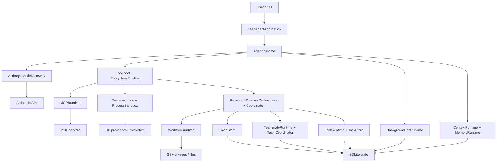
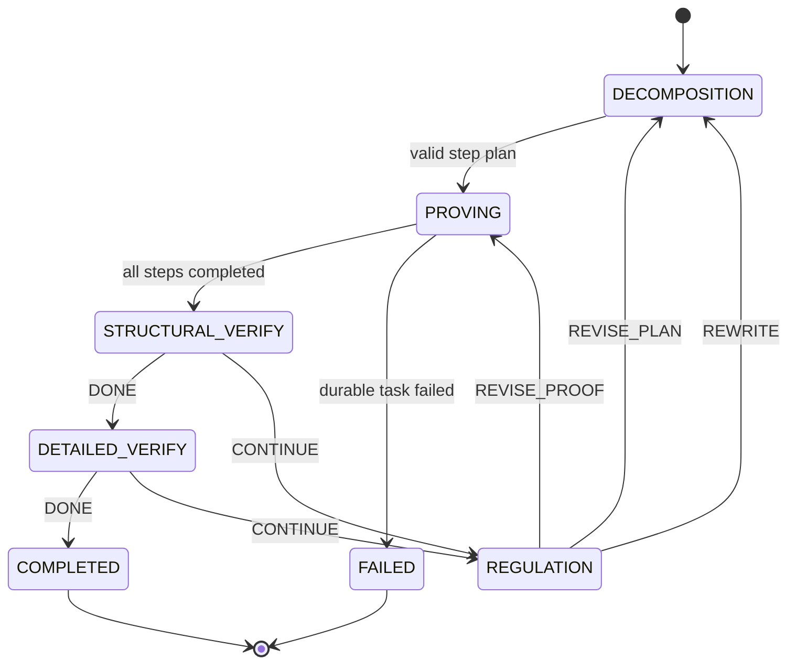
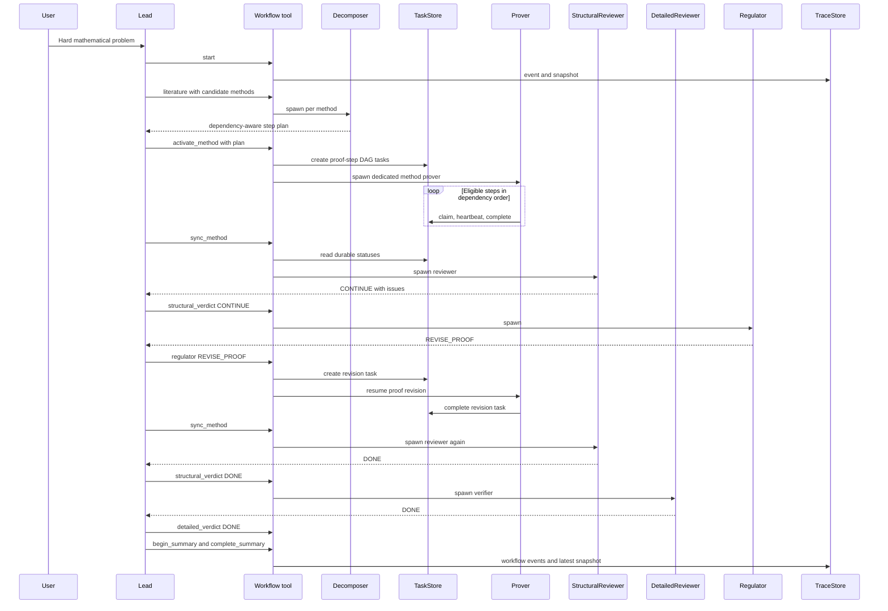

# ResearchAgent Runtime Architecture

This document explains the system as implemented in the current repository. It describes ownership, state, control flow, and failure boundaries rather than every public method. For a shorter introduction, see [README](../README.md); for audit findings, see [Architecture Audit](architecture_audit.md).

## 1. Architectural Goals

ResearchAgent Runtime coordinates long mathematical investigations in which candidate methods, proof steps, reviews, and revisions can span multiple agents and process lifetimes. The engineering goals are durable work assignment, explicit proof-workflow gates, safer tool execution, bounded context, scoped memory, restart visibility, and inspectable traces.

The project is **not** a general workflow engine, distributed cluster scheduler, generic model-provider framework, full container sandbox, or theorem prover that guarantees correctness. Anthropic is the current model path. Agents supply mathematical reasoning; the runtime checks legal transitions and durable task dependencies.

## 2. High-Level Architecture

The diagram is a responsibility map, not a claim that every arrow is a direct Python import. The CLI enters through the composition root. Application code provides research-facing instructions. The runtime owns model/tool loops. The research coordinator owns legal state transitions, while its orchestrator calls task, teammate, worktree, and trace services. SQLite and OS/API integrations sit behind these service boundaries. Dynamic MCP schemas are merged into the per-turn tool pool; they are not permanently inserted into the static ToolRegistry.

## 3. Composition Root

[s20.py](../s20.py) constructs concrete stores and services, injects callables, binds tool handlers to catalog entries, and starts the interactive CLI. It configures TaskStore, JobStore, MemoryStore, MessageStore, TraceStore, AnthropicModelGateway, the policy pipeline, the agent runtimes, MCP, and the research orchestrator.

Keeping this wiring in one place makes dependencies explicit without making lower layers import the entrypoint. It also makes lifecycle visible: initialization currently performs migrations/recovery and starts a cron scheduler thread; `main()` closes persistent MCP clients in a `finally` block. Core task, workflow, policy, and execution rules should remain under `agent_runtime/` rather than accumulate in s20.py. Some aliases in the entrypoint preserve existing handler/callback contracts.

## 4. Application Layer

`LeadAgentApplication` builds the Lead's research identity, tool guidance, memory context, and system prompt. `ResearchTeamApplication` builds teammate role instructions and progress nudges. These prompts tell agents how to reason and report: decompose before proving, use the durable plan, verify details, and return structured reviewer or regulator results.

Neither application module owns SQLite transactions, process execution, or workflow transition rules. This separation matters because a prompt can request verification but cannot reliably prevent an LLM from skipping it. The coordinator rejects illegal transitions even if an agent proposes one. Conversely, the coordinator does not choose lemmas or judge a proof's mathematics.

## 5. Runtime Layer

`AgentRuntime` is the interactive Lead loop: it prepares context, calls the model gateway, dispatches tools, and feeds results back. `SubagentRuntime` performs bounded delegated work and returns a summary; it has no durable team inbox, lease ownership, or full teammate lifecycle. `TeammateRuntime` runs autonomous worker threads that poll inboxes, claim eligible durable tasks, heartbeat leases, use worktree context, and participate in plan/shutdown protocol.

`AnthropicModelGateway` owns Anthropic request construction and provider-specific retry/fallback decisions. `ExecutionTracker` gives all three agent types a shared vocabulary: `RunRecord`, `AgentRecord`, `ToolCallRecord`, and `RuntimeEvent`. It keeps records in memory and sends selected event metadata to TraceStore through a best-effort sink. A subagent's bounded lifetime and a teammate's task/inbox ownership are intentionally different.

## 6. Tool Registry and Dispatch

`BASIC_TOOL_CATALOG` consists of immutable `ToolCatalogEntry` declarations: name, description, input schema, and capability metadata. Binding a handler produces a `ToolDefinition`. `ToolRegistry` rejects duplicate names and exposes model schemas and concrete handlers. `ToolDefinition.to_api_schema()` omits capability metadata; that metadata remains available to policy code without becoming a model-facing schema field.

At the start of a Lead turn, the composition root merges built-in registry schemas/handlers, control tools, and discovered MCP tools into a tool pool. A normal call follows this path:

1. Anthropic returns a `tool_use` block.
2. ExecutionTracker starts a ToolCallRecord.
3. `PreToolUse` invokes the policy pipeline and may block the call.
4. An allowed handler executes inline or starts a durable background job.
5. `PostToolUse` runs, the tool record is finished, and a `tool_result` enters the model conversation.

The special `compact` control tool is handled inside AgentRuntime. Dynamic MCP tools receive normalized `mcp__server__tool` names and handlers at pool assembly time. Their policy capabilities are resolved dynamically rather than from a static catalog entry.

## 7. Policy and Permissions

`PolicyEngine` evaluates tool context and capabilities against ordered rules, returning `ALLOW`, `DENY`, or `ASK`. `PolicyHookPipeline` runs that decision in the pre-tool hook, requests interactive approval for ASK, and records policy decisions. Its JSONL policy audit and TraceStore decision records are best effort; trace failure does not change the policy outcome.

This is an execution gate, not a sentence in a system prompt. It is still one layer of the safety model. Tool-specific validation, path checks, process restrictions, and human approval where required have separate roles. The implementation does not claim that every possible OS escape is prevented.

## 8. Mathematical Research Workflow

**Reasoning is soft; control flow is hard.** The Lead and specialists choose candidate strategies, dependency-aware proof plans, proof text, and review findings. `ResearchWorkflowCoordinator` decides whether the requested transition is legal.

The main domain models are:

- `ResearchRun`: problem reference, difficulty, overall stage, method attempts, selected methods, and final artifact path.
- `MethodAttempt`: one candidate strategy, its prover, plan, verifier state, regulator action, and revision counters.
- `ProofStep`: one goal, predecessor step IDs, and step status.

The declared state vocabulary is:

| Type | Values | Meaning |
| --- | --- | --- |
| `ResearchStage` | `LITERATURE_SURVEY`, `DIRECT_PROOF`, `METHODS_ACTIVE`, `SUMMARY`, `COMPLETED`, `FAILED` | Overall research-run state. `FAILED` is declared; it is not an automatic result of every method failure. |
| `MethodStage` | `DECOMPOSITION`, `PROVING`, `STRUCTURAL_VERIFY`, `DETAILED_VERIFY`, `REGULATION`, `COMPLETED`, `FAILED`, `ABANDONED` | State of one candidate method. |
| `ProofStepStatus` | `PENDING`, `IN_PROGRESS`, `COMPLETED`, `FAILED` | State vocabulary for a proof step; a failed durable task can fail the method without necessarily setting every step to FAILED. |
| `Verdict` | `DONE`, `CONTINUE` | Reviewer result submitted by the Lead. |
| `RegulatorAction` | `REVISE_PROOF`, `REVISE_PLAN`, `REWRITE` | Revision route. |

An easy literature outcome enters direct proof. Medium/hard outcomes require at least one candidate method. Decomposition must produce a valid, nonempty acyclic DAG before proof tasks can be activated.

## 9. Workflow State Machine

`REVISE_PROOF` creates a separate durable revision task; after it completes, the method returns to Structural verification rather than silently reusing an old verdict. `REVISE_PLAN` and `REWRITE` return to Decomposition and can create a new task generation. A Structural DONE does not finish the method: Detailed verification still must return DONE. `begin_summary` rejects any selected method not in COMPLETED.

The LLM can propose a shortcut in text, but the coordinator will not accept an illegal stage transition. TaskStore separately checks dependencies at claim time. These gates enforce process order, not the truth of a reviewer verdict or the existence of a final proof file.

## 10. ResearchWorkflowOrchestrator

`ResearchWorkflowCoordinator` is a pure domain state machine: no model calls, database writes, teammate spawning, or file I/O. `ResearchWorkflowOrchestrator` is the integration layer that exposes the `research_workflow` control-plane tool and applies coordinator transitions to real services.

The orchestrator starts/loads runs; spawns one decomposer per proposed method; calls `set_method_plan` before creating durable proof tasks; maps each ProofStep ID to a TaskStore task ID; binds a dedicated prover and optional worktree; syncs task statuses back into workflow state; spawns Structural, Detailed, and Regulator roles; and writes trace events and recovery snapshots. It does not itself perform mathematical reasoning. Specialist JSON reaches it through explicit Lead tool calls.

This separation makes the transition graph testable without starting model threads or databases. It also exposes a consistency boundary: task creation, worktree operations, teammate spawning, and snapshot saving are not one atomic transaction.

## 11. Method-Level Parallelism

Candidate methods A, B, and C can have separate prover teammates, task DAGs, and proof/worktree artifacts. That allows independent strategies to proceed without forcing one global proof plan.

Inside one method, step A2 may depend on A1, and A3 may depend on both. Proof steps share notation, operator definitions, normalizations, and earlier lemmas. A long-lived prover for the method preserves that local context better than handing each step to an unrelated worker, while TaskStore still controls the dependency order. Worktrees separate files for methods when created; they are not OS security jails.

## 12. Durable Task Orchestration

`TaskRecord` is the persistent task view; `TaskStore` owns SQLite storage, dependencies, statuses, leases, and transactions; `TaskRuntime` adapts that store to tool-facing contracts. Statuses are `pending`, `in_progress`, `completed`, `failed`, and `cancelled`.

A teammate lists eligible tasks, attempts a claim, works under a lease, renews heartbeats, and completes the task. `TaskStore.claim_task` uses `BEGIN IMMEDIATE` to check pending state, owner, and dependencies in the same write transaction before updating the claim. Expired leased tasks may return to pending after a crash; unleased legacy in-progress tasks are not guessed abandoned. Required roles and tags support affinity.

This is why the active task state lives in SQLite rather than JSON files: a filesystem read/modify/write sequence would not provide the same atomic concurrent claim. Legacy JSON tasks are imported once for migration. A completed TaskStore task means the task lifecycle advanced; it is not an independent formal proof certificate.

## 13. Team Coordination and Messaging

`MessageStore` persists messages in SQLite. `MessageBus.send` writes a message, while `read_inbox` calls transactional `consume_inbox`. `TeamCoordinator` routes Lead/teammate messages and tracks plan/shutdown request protocol through `ProtocolState`. Historical JSONL mailboxes are migration inputs, not the active production bus.

A transaction prevents two consumers from taking the same unread message. Unread messages survive restart. The current API is **consume-on-read**, however, rather than claim → process → ack: after the database marks a message consumed, a process crash before application handling can lose that delivery. `ProtocolState` request bookkeeping is process-local and is not reconstructed from MessageStore after restart.

## 14. Background Jobs and Scheduling

A **task** is agent or research work with dependency/lease semantics. A **job** is asynchronous runtime execution or scheduled delivery. `JobRecord` and `JobStore` persist job status, attempts, payloads/results, and cron schedules. Background job payloads can include raw tool inputs or commands, and results can include full tool output; jobs.db is sensitive local state. Job statuses are `queued`, `running`, `succeeded`, `failed`, `cancelled`, and `timed_out`.

`BackgroundJobRuntime` places eligible tool calls into JobStore and uses `ThreadJobRunner` to execute them. Potentially side-effecting background tool calls use one attempt; an interrupted running job is marked failed rather than replayed blindly. Queued jobs can be resumed. `CronSchedulerRuntime` persists schedule definitions and occurrence IDs, recovers interrupted jobs according to retry budget, and delivers scheduled prompts. Its current delivery marks a prompt job succeeded before the Lead loop runs, leaving a possible lost-delivery crash window. Neither subsystem promises exactly-once effects.

## 15. Context Runtime

`ContextRuntime` writes full transcripts, stores oversized tool outputs separately, shrinks large current tool-result blocks, and asks `ContextBudgetManager` to compact older lower-priority results. If the estimated budget is still exceeded, it creates a structured checkpoint using a model summary and projects relevant fields into scoped memory. A prompt-too-long error can trigger reactive compaction while retaining recent messages.

The implementation has a `HeuristicTokenEstimator`, not exact Anthropic token accounting. There is no separate public “snip” or “micro compaction” subsystem in the current code; the concrete mechanisms are result persistence/budgeting, priority-aware older-result compaction, checkpoint summary, and reactive fallback. Transcripts and checkpoints may contain conversation text and should be treated as local state.

## 16. Memory Runtime

`MemoryRecord` has working, episodic, or artifact kind. `MemoryStore` persists records and `MemoryScope` entries in SQLite. `MemoryRuntime` tracks the active problem/session scope, offers current/global/all scope selection, supports explicit scope switching, and can promote stable facts to global memory. Checkpoint projection writes goals/constraints as working memory, completed work as an episode, and the transcript pointer as an artifact.

Retrieval uses scoped deterministic storage and text matching; the current repository has no embedding or vector index. For mathematical work, explicit scope and provenance help prevent unrelated problems from contaminating a new proof. Similarity retrieval could be added later if a real need justifies its complexity.

## 17. Safe Execution

### SymPy executor

`SafeSympyExecutor` sends restricted code to `security/_sympy_worker.py` in a child process. The worker applies AST checks, rejects imports and dangerous introspection/file/process surfaces, and exposes a curated SymPy namespace. The parent bounds code size, output size, and wall time, uses a temporary working directory and minimal environment, and attaches process resource controls. The only execution of compiled model code occurs in that worker, not the Agent host process.

### Command executor

`SandboxedCommandExecutor` parses one command into arguments, uses an executable allowlist, rejects shell chaining/redirection/substitution and shell interpreters, restricts Python script/module entry points, checks workspace paths, and starts the process with `shell=False`. It bounds output and terminates long-running process trees. A permitted executable is still real OS code, so these are narrower controls than an OS jail.

### ProcessSandbox

Windows attaches a Job Object for memory, CPU, and process-tree controls. POSIX applies resource limits such as `prlimit` where available. The attachment occurs immediately after process launch, so the boundary is not identical to a container or cgroup launch. If strict network or filesystem isolation is requested, the built-in backends fail closed because they do not provide those capabilities.

### Archive extraction

`SafeArchiveExtractor` validates each member and copies it manually. It rejects absolute and parent-traversal paths, Windows device/stream paths, links, devices, FIFOs, duplicate targets, and archives over member/file/total size limits. It does not use `tar.extractall()`.

## 18. MCP Runtime

`MCPRuntime` loads server specs from the trusted `~/.researchagent/mcp_servers.json` path, outside the agent-writable workspace. The config can choose stdio or Streamable HTTP transport and may reference credential environment variables. Keeping it outside the workspace prevents ordinary agent file writes from silently changing trusted server commands or endpoints.

For a configured server, `PersistentMCPClient` establishes an official SDK session, initializes transport, calls `tools/list`, normalizes tool schemas/names, and owns an asyncio loop in a dedicated thread. Tool names exposed to the Lead are `mcp__server__tool`. On connection loss, a later call can reconnect. An ambiguous failed or timed-out call is not replayed automatically because a side effect might already have reached the server.

`MockMCPRuntime` remains a teaching/demo fallback for names without a real spec. A configured real server of the same name wins; a failed real connection returns an error instead of silently substituting Mock. Live sockets/sessions are not serialized for process restart.

## 19. Observability

`ExecutionTracker` creates runtime event metadata for agent runs, model calls, and tool lifecycles. Its event sink sends records to `TraceStore`, which keeps `.state/traces.db` tables for runtime events, model calls, policy decisions, task transitions, workflow events, and workflow snapshots. Usage, latency, retry counts, tool status, and workflow stage changes support inspection through `agent_runtime.observability.viewer`.

Runtime/model/tool producers currently emit metadata rather than raw prompts, shell commands, or complete tool outputs. Trace sink failures are caught by ExecutionTracker, TaskRuntime, the policy pipeline, and workflow trace wrappers so ordinary tracing errors do not stop an Agent turn. TraceStore itself is not a universal redactor. Recovery snapshots include problem references, literature notes, proof-step goals, and regulator notes; this database may contain sensitive research text.

Events and snapshots serve different purposes: events explain what changed over time, while the latest snapshot reconstructs current research state and task bindings.

## 20. Research Evaluation

`ResearchEvaluation` summarizes the latest ResearchRun snapshot together with recorded workflow events: run stage, methods explored/completed/failed, current proof-step completion, verifier outcomes, revision counts, and final artifact path. Historical verifier counts come from workflow events rather than only the latest method fields, because a revision can clear the current verdict state. Older snapshots without verdict events use their available snapshot fields.

A final-answer string comparison is a poor sole metric for mathematical work. The orchestration evidence matters: Was the workflow completed? Were candidate methods decomposed? Did proof tasks finish in dependency order? Were both verification gates visited? Did a failed method get revised or abandoned? Is an artifact path recorded? These metrics still do not grade mathematical truth. Model/tool usage and optional cost are trace summaries, not proof-quality scores.

The implemented [offline mathematical benchmark](../benchmarks/README.md) runs four deterministic cases through the real coordinator, orchestrator, TaskStore, TraceStore, and ResearchEvaluation. It checks direct proof, dependency execution, failed-method exclusion, and a Structural CONTINUE → REVISE_PROOF → Structural DONE → Detailed DONE route. Its fixture proof files explicitly are not mathematical proofs; a non-interactive live benchmark entry point is not wired.

## 21. Durability Matrix

| Subsystem | Store / lifetime | Restart behavior |
| --- | --- | --- |
| Tasks and dependencies | `.state/tasks.db` | Rows, dependencies, and leases persist; expired leases can be recovered. |
| Jobs and schedules | `.state/jobs.db` | Statuses and occurrences persist; interrupted jobs follow retry budget. |
| Team messages | `.state/team.db` | Unread messages persist; consumed messages are not redelivered. |
| Memory and scopes | `.state/memory.db` | Records/scopes persist; the active in-process scope is initialized or selected again. |
| Research workflow | Snapshot in `.state/traces.db` | Run and method/task bindings are restored; live workers are not. |
| Trace events | `.state/traces.db` | Recorded event history remains queryable. |
| MCP client | In-process session/thread | Connection is not restored as a live socket; reconnect when needed. |
| Teammate | In-process thread | Thread is not recreated automatically from workflow snapshot. |
| Tool transcripts / proof files | Workspace files/worktrees | Files remain unless separately removed; their contents are not a SQLite transaction. |

## 22. Crash and Restart Semantics

Suppose method A is PROVING, step 3 has completed, and step 4 is pending. A process crash leaves the completed/pending TaskStore rows in SQLite. On restart, the orchestrator loads its latest ResearchRun snapshot and step-to-task bindings from TraceStore. A later `sync_method` reads TaskStore statuses and can advance the in-memory proof-step state. The previous prover thread is gone; the Lead must inspect status and explicitly arrange resumed worker execution. Expired task leases can be recovered, but a lease recovery is not proof that a side effect did not occur.

TaskStore and TraceStore transactions are separate. A crash after creating a step task but before saving its new workflow snapshot can leave the two views inconsistent. Blindly repeating `activate_method` may create another generation of tasks. The correct recovery approach is reconciliation of both stores and worktree artifacts before retrying an action. The current runtime provides snapshots and status inspection, not a cross-store exactly-once transaction.

## 23. Hard-Problem Sequence

The Lead submits structured results to the control-plane tool. The Workflow participant represents Orchestrator calls through Coordinator rules; the Lead does not directly mutate ResearchRun fields. The diagram shows one successful revision route; other methods can run independently, and an actual crash may interrupt any non-atomic span.

## 24. Core Data Models

| Model | Purpose | Lifetime / persistence |
| --- | --- | --- |
| `RunRecord` | One agent execution run and parent/child relation. | In-memory ExecutionTracker; selected lifecycle events persisted in TraceStore. |
| `AgentRecord` | Identity, kind, role, and parent agent for a run. | In-memory tracker; start/finish event metadata persisted. |
| `ToolCallRecord` | Tool lifecycle and status, including blocked/background outcomes. | In-memory tracker; selected tool events persisted. |
| `RuntimeEvent` | Timestamped execution event with safe metadata. | Bounded in-memory buffer; best-effort TraceStore event row. |
| `TaskRecord` | Durable task, owner, dependencies, role affinity, lease. | TaskStore SQLite row(s). |
| `JobRecord` | Background/scheduled job status, attempts, payload, result. | JobStore SQLite row. |
| `MemoryRecord` | Working, episodic, or artifact memory with scope. | MemoryStore SQLite row. |
| `ResearchRun` | Overall research stage and selected methods. | In memory and latest TraceStore workflow snapshot. |
| `MethodAttempt` | Candidate method stage, plan, prover, review/revision state. | Part of ResearchRun snapshot. |
| `ProofStep` | Atomic goal, predecessor IDs, and workflow step status. | Part of method snapshot; corresponding execution task in TaskStore. |

The record layers are related but not interchangeable: ToolCallRecord tracks a tool invocation; JobRecord can represent asynchronous execution of such a call; TaskRecord represents agent/research work; ProofStep is the mathematical workflow concept mapped to a task ID by the orchestrator.

## 25. Concurrency Model

The Lead runs in the interactive CLI flow. Autonomous teammates use daemon threads. Background jobs use ThreadJobRunner threads. Persistent MCP clients own a dedicated asyncio event loop and session thread. The cron scheduler and CLI autorun delivery run in daemon threads.

In-memory locks protect tracker records, active teammate names, scheduler setup, and the Lead's shared conversation history. SQLite write transactions protect durable claims and other store updates across threads/processes. Those mechanisms solve different races; a Python lock does not make separate SQLite databases atomic. Thread lifecycle is not complete structured concurrency: CLI shutdown closes MCP clients but does not uniformly stop/join all teammate, scheduler, and background-job threads.

## 26. Consistency Boundaries

**Task versus workflow snapshot.** Creating a TaskStore row commits to `tasks.db`. Saving a ResearchRun snapshot commits separately to `traces.db`. A crash between them may leave an unbound task or a snapshot behind the task's real status. Workflow events and snapshots are also separate writes; an event may exist without the matching latest snapshot.

**Message consumption.** MessageStore commits `consumed_at` before returning messages to the application. A crash after that commit but before protocol handling leaves no unread message to retry. This prevents duplicate concurrent consumption but does not guarantee processed-once delivery.

**External effects.** MCP and subprocess calls can affect systems outside SQLite. Their effects cannot be rolled back with a local database transaction. The runtime avoids blind replay of ambiguous running background tool/MCP calls. Cron prompt delivery has its own acknowledged-before-agent-loop loss window.

Durable state makes failures inspectable and supports recovery, but the system does not offer end-to-end exactly-once execution.

## 27. Security Boundaries

Three layers should be distinguished:

1. **Application-level restrictions:** capability policy, ASK/DENY decisions, allowlisted tools and paths, worktree discipline, AST validation.
2. **Process resource restrictions:** child process, timeout, bounded output, Windows Job Object, POSIX limits, process-tree termination.
3. **Strong OS isolation:** a network namespace, filesystem jail, VM, or universal container boundary. These are **not** provided by the built-in backends.

Trusted MCP configuration is deliberately outside the agent-writable workspace. The workflow state machine prevents stage-skipping; it does not authenticate the truth of model-supplied reviews. A TaskStore completion is a lifecycle transition, not a proof checker. Recovery snapshots and transcripts can contain research text; background JobStore rows can also contain raw tool inputs and outputs. Handle these databases and files as sensitive local state.

## 28. Major Design Decisions

- **SQLite over JSON state files:** transactions permit atomic claims, dependency checks, concurrent access, and idempotent migration from earlier files.
- **Hard workflow over prompt-only orchestration:** the legal research stages must survive model drift, context compaction, and revision loops. Prompt text remains useful for mathematics, but it is not the authority for transitions.
- **One prover per method:** separate method context enables strategy-level parallelism while preserving notation and proof continuity inside each DAG.
- **Coordinator separate from Orchestrator:** pure transition rules can be tested independently; integration code owns task creation, teammate/worktree effects, and persistence.
- **No automatic replay of ambiguous MCP effects:** reconnecting a transport is safe to attempt; repeating an unknown side-effecting tool operation is not.
- **SymPy in a child process:** model-generated code should not execute in the long-lived Agent process; AST checks and resource limits reduce the worker's exposure.
- **Events plus snapshots:** events explain historical verification/revision activity; the latest snapshot provides fast reconstruction of current state and task bindings.

## 29. Extension Points

The four-case offline workflow benchmark and CLI Trace Viewer are implemented. Future improvements include a non-interactive live benchmark entry point, richer mathematical quality evaluation or proof-assistant integration, stronger OS isolation, claim/ack team messaging, cross-store workflow/task reconciliation, and safe teammate reconstruction. Each must preserve hard workflow gates and explicit side-effect recovery semantics.

## 30. Summary

ResearchAgent Runtime combines LLM mathematical reasoning with a Python control plane, durable task execution, specialist verification and revision loops, constrained tools, and inspectable traces. Its state-machine and SQLite boundaries make long-running work more recoverable and auditable than a prompt-only loop. The remaining consistency and OS-isolation limits are part of the architecture and must remain visible to operators and future maintainers.
